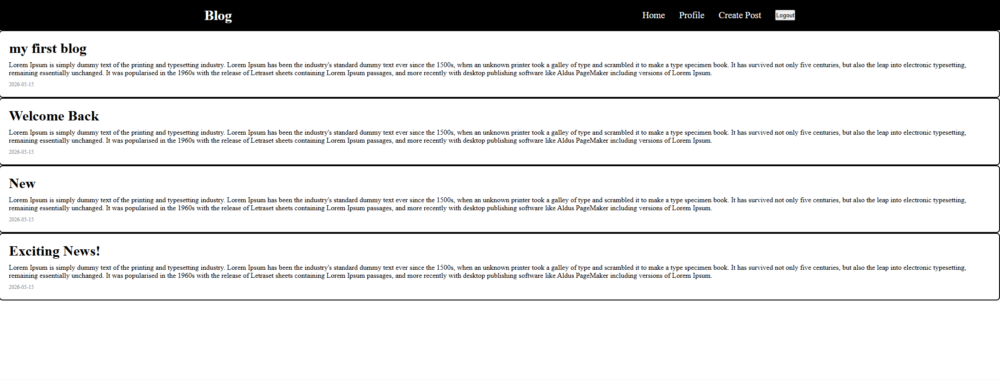

# Blog

This is a full-stack Blog website.  
It allows users to signup, login, create posts, view and delete posts.

It includes the following sections:
- **Home**: View all available blog posts with details such as title, content and date created.
- **Signup**: create an account in order to create and manage you posts.
- **Login**: login to your account.
- **Create Posts**: create new posts using a form.
- **Profile**: view all your posts and delete them.
 
---

## 📷 Preview



---

## 🚀 Live Demo

Check out the live version of the Blog project  
[live demo](https://blog-rho-three-24.vercel.app/)

---

## 🏁 Getting Started

### 1. Clone the repository, and change to it:
```bash
git clone https://github.com/Ganja0003/blog.git
cd blog/frontend
```

### 2. Install dependencies:
```bash
npm install
```

### 3. Run development server:
```bash
npm run dev
```
(The backend API and database are hosted on Railway, so no local database setup is required.)

---

## 🛠 Built with

- **Next.js** (Frontend & Backend)
- **Vercel** (Frontend deployment)
- **Railway** (Backend & Database deployment)
